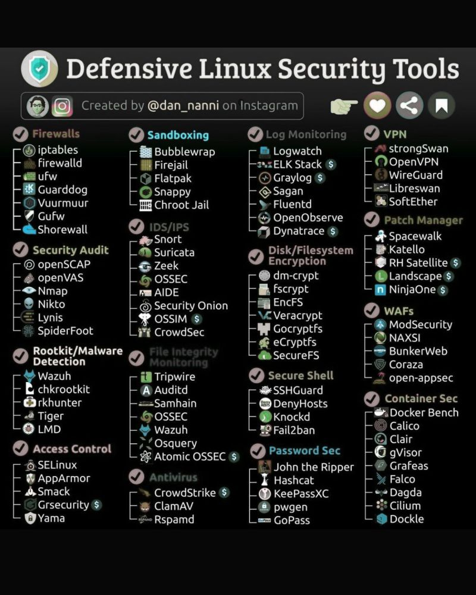

*This is a working list. I add to it as I find new tools and resources.*
 

# 🔍 Analysis & Investigation 🔍 
<!-- Carving Tools --> 

Carving Tools

  - **Aorimn/Dislocker**  
    Dislocker allows access to BitLocker-encrypted drives by decrypting them or providing a virtual unlocked drive.  
    [Aorimn/dislocker](https://github.com/Aorimn/dislocker)
  ---
  - **Autopsy**  
    An open-source digital forensics platform with a graphical interface to The Sleuth Kit.  
    [Autopsy](https://www.autopsy.com/extend-autopsy/)
 ---
  - **BulkExtractor**  
    A digital forensics tool that scans disk images, files, or directories to extract features like email addresses, URLs, and credit card numbers without mounting the file system.  
    [bulk_extractor](https://github.com/simsong/bulk_extractor)
---
  - **Extundelete**  
    A Linux utility for recovering deleted files from ext3/ext4 file systems.  
    [extundelete](http://extundelete.sourceforge.net/)
---
  - **Foremost**  
    A console program to recover files based on their headers, footers, and internal data structures.  
    [Foremost](https://foremost.sourceforge.net/)
---
  - **PhotoRec**  
    A file data recovery software designed to recover lost files including videos, documents, and archives from hard disks and CD-ROMs.  
    [PhotoRec Data Carving](https://www.cgsecurity.org/wiki/PhotoRec_Data_Carving)
---
  - **Scalpel**  
    An open-source file carving and indexing application for Linux and Windows, based on Foremost.  
    [Scalpel](https://github.com/sleuthkit/scalpel)
---
  - **Trellix**  
    The new name for the merged McAfee Enterprise and FireEye companies, offering cybersecurity solutions including endpoint, network, and email protection.  
    [Trellix](https://www.mcafee.com/enterprise/en-us/downloads/free-tools/hfind.html)
---
  - **Xplico**  
    A network forensics analysis tool (NFAT) that reconstructs application-level data (emails, web pages, VoIP) from captured network traffic.  
    [Xplico](http://www.xplico.org/)

---
<!-- Digital Forensic Frameworks --> 

Digital Forensics Frameworks

  - **Autopsy**  
    An open-source digital forensics platform with a graphical interface to The Sleuth Kit.  
    [Autopsy | Digital Forensics](https://www.autopsy.com/)
---
  - **Arxsys/diff**  
    A forensic comparison tool that identifies differences between two datasets (e.g., disk images, file systems).  
    [arxsys/dff](https://github.com/arxsys/dff)
---
  - **CAINE**  
    A Linux live distribution tailored for digital forensics with pre-installed analysis tools.  
    [CAINE Live USB/DVD](https://www.caine-live.net/)
---
  - **Deftlinux**  
    A Linux-based live distro for forensic investigations, focusing on incident response and digital evidence handling.  
    [Deftlinux](http://www.deftlinux.net/)
---
  - **NSRLLookup**  
    A tool or website to check file hashes against the National Software Reference Library (NSRL) to identify known, non-suspicious files.  
    [nsrllookup/README.md at master · rjhansen/nsrllookup](https://github.com/rjhansen/nsrllookup/blob/master/README.md)
---
  - **SIFT Workstation**  
    A free Linux virtual machine pre-configured with a suite of forensic and incident response tools, maintained by SANS.  
    [SIFT Workstation | SANS Institute](https://digital-forensics.sans.org/community/downloads)
---
  - **The Sleuth Kit (TSK)**  
    A collection of command-line tools and a C library that allows you to analyze disk images and recover files from them.  
    [The Sleuth Kit (TSK) & Autopsy: Open Source Digital Forensics Tools](https://www.sleuthkit.org/)
---
  - **Volatility**  
    An advanced memory forensics framework for incident response and malware analysis.  
    [Volatility](https://www.volatilityfoundation.org/)
---
  - **X-Ways Forensics**  
    An advanced work environment for computer forensic examiners, offering powerful features for disk cloning and imaging.  
    [X-Ways Forensics: Integrated Computer Forensics Software](https://www.x-ways.net/forensics/)

---

<!-- Digital Forensic -->

  
Disk Forensics

  - **Encase**  
  A comprehensive digital forensics platform used for data acquisition, analysis, and evidence management.
  
     [EnCase](https://www.opentext.com/products-and-solutions/products/software/encase-platform)
---
  - **Exterro**  
    A suite of digital forensics and e-discovery software used for legal investigations and compliance, supporting data collection and analysis.

    [Data Risk Management - Data Discovery & Privacy Platform | Exterro](https://accessdata.com/product-download)
---
  - **Guymager**  
    A free forensic imager for media acquisition, known for its speed and ease of use. 

    [Guymager homepage](https://guymager.sourceforge.io/)
---
  - **Magnet AXIOM**  
    A digital investigation platform that allows examiners to seamlessly acquire and analyze forensic data from various sources.  
    
    [Magnet Axiom | Digital Forensic Software | Magnet Forensics](https://www.magnetforensics.com/products/magnet-axiom/)
---
  - **The Sleuth Kit (TSK)**  
    A collection of command-line tools and a C library that allows you to analyze disk images and recover files from them. 

    [The Sleuth Kit (TSK) & Autopsy: Open Source Digital Forensics Tools](https://www.sleuthkit.org/)
---
  - **WinHex**  
    A powerful hex editor and disk editor used for computer forensics, data recovery, and low-level disk operations.  

    [WinHex: Hex Editor & Disk Editor, Computer Forensics & Data Recovery Software](https://www.x-ways.net/winhex/)
---
  - **X-Ways**  
    An advanced work environment for computer forensic examiners, offering powerful features for disk cloning and imaging. 

    [X-Ways Forensics: Integrated Computer Forensics Software](http://www.x-ways.net/forensics/)

---

<!-- Hex Editors --> 

Hex Editors

  - **HxD**  
    A free, fast hex editor that can handle files of any size.  
    [HxD - Freeware Hex Editor and Disk Editor | mh-nexus](https://mh-nexus.de/en/hxd/)
---
  - **010 Editor**  
    A professional hex editor with Binary Templates technology for parsing binary files.  
    [010 Editor - Pro Text/Hex Editor | Edit 280+ Formats | Fast & Powerful | Reverse Engineering](https://www.sweetscape.com/010editor/)
---
  - **Hex Fiend**  
    A fast and clever hex editor for macOS, capable of handling large files.  
    [Hex Fiend, a fast and clever hex editor for macOS](https://hexfiend.com/)
---
  - **HexEd**  
    A simple hex editor for viewing and editing raw binary files in hexadecimal format.  
    [HexEd.it - Browser-based Online and Offline Hex Editing](https://hexed.it/)

---

<!-- Malware Analysis --> 

Malware Analysis

---
  - **Any.Run**  
    Interactive malware sandbox.  
    [ANY.RUN - Interactive Online Malware Sandbox](https://any.run/)
  ---
  - **Bazaar**  
    An open repository hosting malware samples (with hashes and metadata) to support malware research and analysis.  
    [Bazaar](https://bazaar.abuse.ch/browse/)
---
  - **CAPA**  
    A tool from Mandiant/FLARE that automatically identifies capabilities in executables by matching code patterns to known techniques.  
    [capa Explorer Web](https://mandiant.github.io/capa/explorer/#/)
---
  - **Cutter**  
    A Qt and C++ GUI powered by Radare2, providing an intuitive interface for reverse engineering.  
    [Cutter](https://cutter.re/)
---
  - **DC3-MWCP**  
    A Python library and tool from the U.S. DoD Cyber Crime Center for extracting configuration data from malware samples.  
    [DC3-MWCP | GitHub](https://github.com/dod-cyber-crime-center/DC3-MWCP)
---
  - **FLARE-VM**  
    A Windows-based virtual machine designed for malware analysis and reverse engineering, packed with analysis and debugging tools.  
    [FLARE-VM | GitHub](https://github.com/mandiant/flare-vm)
---
  - **Ghidra**  
    A software reverse engineering suite developed by the NSA, supporting various platforms.  
    [Ghidra](https://ghidra-sre.org/)
---
  - **Hybrid Analysis**  
    Free malware analysis service powered by Falcon Sandbox.  
    [Hybrid Analysis](https://www.hybrid-analysis.com/)
---
  - **IDA Free**  
    A powerful disassembler and debugger for analyzing binary programs.  
    [IDA Free](https://hex-rays.com/ida-free)
---
  - **Intezer Analyze**  
    Malware code reuse detection via binary analysis.  
    [Intezer Analyze](https://analyze.intezer.com/)
---
  - **MalShare**  
    The MalShare Project is a collaborative effort to create a community driven public malware repository that works to build additional tools to benefit the security community at large.  
    [MalShare](https://malshare.com/)
---
  - **Malware Archaeology Cheat-Sheets**  
    Free downloadable cheat sheets summarizing logging, forensic artifacts, and malware detection strategies.  
    [Cheat-Sheets | Malware Archaeology](https://www.malwarearchaeology.com/cheat-sheets)
---
  - **Malware Network Analysis Idea**  
    Within REMnux: place a malware sample into the VM, create a restore point, set up INetSim, run the malware sample for a few minutes, stop INetSim, then check `/var/logs/inetsim/reportxxx` to view the malware’s network connections in a sandboxed environment.  
    🔒 Disable your real internet connection; INetSim tricks the malware into thinking it’s reaching the internet.
---
  - **Malware-Traffic-Analysis.net**  
    A website offering free PCAP files and tutorials to practice analyzing malware-related network traffic.  
    [malware-traffic-analysis.net](https://www.malware-traffic-analysis.net/)
---
  - **MetaDefender Cloud OPSWAT**  
    File, URL, and hash scanning across multiple AV engines.  
    [MetaDefender](https://metadefender.com/)
---
  - **Radare2**  
    An open-source framework for reverse engineering and analyzing binaries.  
    [Radare2 | GitHub](https://github.com/radareorg/radare2)
---    
  - **REMnux**  
    A Linux toolkit for reverse-engineering and analyzing malicious software.  
    [REMnux: A Linux Toolkit for Malware Analysts](https://remnux.org/)  
    [REMnux Tool Tips](https://docs.remnux.org/tips/remnux-tool-tips)
---
  - **VirusTotal**  
    File, URL, and hash scanning across multiple AV engines.  
    [VirusTotal](https://www.virustotal.com/)

---
<!-- Memory Forensics --> 

Memory Forensics

  - **FireEye Freeware Apps**  
    Free tools provided by FireEye (now part of Trellix) for malware analysis, like Redline and Flare tools.  
    [FireEye Freeware Apps](https://fireeye.market/apps?types=freeware_apps)
---
  - **LiME (Linux Memory Extractor)**  
    A tool for acquiring memory from Linux and Linux-based devices.  
    [LiME | GitHub](https://github.com/504ensicsLabs/LiME)
---
  - **Rekall**  
    A memory analysis framework designed to be fast, scalable, and modular.  
    [Rekall | GitHub](https://github.com/google/rekall)
---
  - **Volatility**  
    An advanced memory forensics framework for incident response and malware analysis.  
    [Volatility Foundation](https://www.volatilityfoundation.org/)
---
  - **VolDiff**  
    A memory analysis tool comparing memory images to identify injected code, hooks, or other anomalies.  
    [VolDiff | GitHub](https://github.com/aim4r/VolDiff)

---
<!-- OSINT --> 

OSINT

  - **IntelTechniques Search Tool**  
    An OSINT toolset by Michael Bazzell providing automated searches and investigative tools for public data collection.  
    [IntelTechniques Search Tool](https://inteltechniques.com/tools/Business.html)
---
  - **Maltego**  
    An interactive data mining tool that renders directed graphs for link analysis.  
    [Maltego Homepage](https://www.maltego.com/)
  - **OSINT Framework**  
    A web-based collection of categorized links and tools to assist in open-source intelligence gathering.  
    [OSINT Framework](https://osintframework.com/)
---
  - **Recon-ng**  
    A full-featured web reconnaissance framework written in Python.  
    [Recon-ng | GitHub](https://github.com/lanmaster53/recon-ng)
---
  - **SpiderFoot**  
    An open-source intelligence automation tool with a web-based interface.  
    [SpiderFoot - Attack Surface Exposure](https://www.spiderfoot.net/)
---
  - **theHarvester**  
    A tool for gathering email accounts and domain/subdomain names from public sources.  
    [theHarvester | GitHub](https://github.com/laramies/theHarvester)

---
<!-- Windows Artifact Analysis --> 

Windows Artifact Analysis

  - **KAPE**  
    A triage program that collects and processes forensic artifacts.  
    [KAPE | Kroll](https://www.kroll.com/en/services/cyber-risk/incident-response-litigation-support/kape)
---
  - **Log2Timeline (Plaso)**  
    A tool designed to extract timestamps from various files and create a super timeline.  
    [Plaso Documentation](https://plaso.readthedocs.io/en/latest/)
---
  - **PECmd**  
    A tool for parsing Windows Prefetch files.  
    [Eric Zimmerman's MDwiki](https://ericzimmerman.github.io/)
---
  - **Registry Explorer**  
    A tool for viewing and analyzing Windows Registry files.  
    [Eric Zimmerman's MDwiki](https://ericzimmerman.github.io/)
---
  - **RegRipper 3.0**  
    A registry parsing tool for extracting and reporting Windows Registry data useful for forensic investigations.  
    [RegRipper 3.0 | GitHub](https://github.com/keydet89/RegRipper3.0)

 
<!-- Attack Simulation & Offense Category> -->

# 🚩 Attack Simulation & Offense 🚩 

<!-- Reconnaissance (Information Gathering)-->

Reconnaissance (Information Gathering)

- **Amass**  
    OWASP project for DNS enumeration and OSINT collection.  
    [OWASP Amass | OWASP Foundation](https://owasp.org/www-project-amass/)
---
  - **Assetfinder**  
    Find subdomains and assets
    [Assetfinder](https://github.com/tomnomnom/assetfinder)
---
  - **Aquatone**  
    Screenshot websites for visual reconnaissance 
    [Aquatone**](https://github.com/michenriksen/aquatone)
---
  - **crt.sh**  
    Public certificate transparency log search
    [crt.sh](https://crt.sh/)
---
  - **CloudSploit**  
    AWS misconfiguration scanner
    [CloudSploit](https://github.com/aquasecurity/cloudsploit)
---
  - **GCPBucketBrute	**  
    Discover open Google Cloud buckets	
    [GCPBucketBrute	](https://github.com/RhinoSecurityLabs/GCPBucketBrutee)
---
  - **Fierce**  
    Directory, DNS, and S3 bucket brute-forcer
    [Fierce](https://github.com/mschwager/fierce)
---
  - **Maltego**  
    An interactive data mining tool that renders directed graphs for link analysis.  
    [Homepage](https://www.maltego.com/)
---
- **Masscan**  
    Fast port scanner  
    [TCP port scanner, spews SYN packets asynchronously, scanning entire Internet in under 5 minutes.](http://github.com/robertdavidgraham/masscan)
---
  - **Nmap**  
    Port Scanner  
    [Nmap: the Network Mapper - Free Security Scanner](http://nmap.org/)
---
  - **Netdiscover**  
    Passive network discovery (ARP scanning)
    [Netdiscover](https://github.com/alexxy/netdiscover)
---
  - **Osmedeus**  
    Automated offensive security framework
    [Osmedeus](https://github.com/j3ssie/Osmedeus)
---
- **Recon-ng**  
    Web recon framework for OSINT  
    [Recon-ng](https://github.com/lanmaster53/recon-ng)
---
  - **ReconSpider**  
    OSINT, social media, DNS, subdomain recon. 
    [ReconSpider](https://github.com/bhavsec/reconspider)
---
  - **S3Scanner**  
	 Find open Amazon S3 buckets	
    [S3Scanner](https://github.com/sa7mon/S3Scanner)
---
  - **Sherlock**  
	 Automated OSINT recon tool
    [Sherlock](https://github.com/sherlock-project/sherlock)
---
  - **Shodan**  
    Search engine for internet-connected devices and exposed services.  
    [Shodan](https://www.shodan.io/)
---
  - **Sn1per**  
	 Automated recon and vulnerability scanning	
    [Sn1per	](https://github.com/1N3/Sn1per)
---
  - **Sublist3r**  
    Fast subdomain enumeration 
    [Sublist3r](https://github.com/aboul3la/Sublist3r)
---
  - **SpiderFoot**  
    An open-source intelligence automation tool with a web-based interface.  
    [Attack Surface Exposure](https://www.spiderfoot.net/)
---
- **theHarvester**  
    Email, subdomain, username collector 
    [theHarvester](https://github.com/laramies/theHarvester)

---

<!-- Scanning & Enumeration-->

Scanning & Enumeration

---

<!-- Exploitation-->

Exploitation

---

<!-- Post-Exploitation-->

Post-Exploitation

---

<!-- Reporting-->

Reporting

<!-- Active Directory -->

---

Active Directory

  - **ADExplorer**  
    Sysinternals tool for Active Directory exploration.  
    [AD Explorer - Sysinternals](https://learn.microsoft.com/en-us/sysinternals/downloads/adexplorer)
---
  - **BloodHound**  
    Maps Active Directory relationships to identify privilege escalation and attack paths using graph theory.  
    [BloodHound Docs](https://bloodhound.readthedocs.io/en/latest/index.html)  
    [BloodHound Cypher Cheatsheet](https://hausec.com/2019/09/09/bloodhound-cypher-cheatsheet/)
---
  - **LAPSDump**  
    Dump LAPS passwords from Active Directory.  
    [creddump7 | GitHub](https://github.com/CiscoCXSecurity/creddump7)
---
  - **PingCastle**  
    AD security health scanner.  
    [PingCastle](https://www.pingcastle.com/)
---
  - **PlumHound**  
    Post-processing and visualization tool for BloodHound data to help prioritize and interpret AD attack paths.  
    [PlumHound | GitHub](https://github.com/PlumHound/PlumHound)
---
  - **PowerView**  
    PowerShell Active Directory reconnaissance tool.  
    [PowerView | GitHub](http://github.com/PowerShellMafia/PowerSploit/tree/master/Recon)
---
  - **Sharphound**  
    Data Collector for BloodHound.  
    [SharpHound | GitHub](https://github.com/BloodHoundAD/SharpHound3)

<!-- Capture The Flags (CTFs) -->

---

Capture The Flags (CTFs)

  - **CTFtime**  
    Tracks global CTF events, team rankings, and writeups.  
    [CTFtime](https://ctftime.org/ctfs)
---
  - **Hack The Box**  
    Interactive platform to practice penetration testing in a virtual lab.  
    [Hack The Box](https://www.hackthebox.com/)
---
  - **Haiku CTFs**  
    CTF challenges by Haiku Pro.  
    [Haiku Pro](https://haikuinc.io/products/haiku-pro)
---
  - **HackThisSite**  
    Platform offering hacking challenges.  
    [HackThisSite](https://hackthissite.org/)
---
  - **OverTheWire**  
    Classic CTF-style wargames focused on exploitation and privilege escalation.  
    [OverTheWire](https://overthewire.org/wargames/)
---
  - **PicoCTF**  
    Beginner-friendly CTF designed by Carnegie Mellon University.  
    [picoCTF](https://picoctf.org/)
---
  - **Parrot CTFs**  
    CTF platform hosted by Parrot Security, offering hacking and cybersecurity challenges.  
    [Parrot CTFs](https://parrot-ctfs.com/)
---
  - **PwnTillDawn**  
    Interactive pentesting platform simulating corporate network environments.  
    [PwnTillDawn Online](https://online.pwntilldawn.com/Account/Login?ReturnUrl=%2f#)
---
  - **Splunk Boss of the SOC**  
    Free log analysis CTF.  
    [Splunk Boss of the SOC](https://www.splunk.com/en_us/training/boss-of-the-soc.html)
---
  - **TryHackMe**  
    Guided, gamified learning for cybersecurity with beginner to advanced CTF challenges.  
    [TryHackMe](https://tryhackme.com/login)

---
<!-- Pentesting References & Guides -->

Pentesting References & Guides

  - **0xdf Hacks Stuff**  
    Walkthroughs for HackTheBox, TryHackMe, and hacking challenges.  
    [0xdf hacks stuff](https://0xdf.gitlab.io/)
---
  - **GTFOBins**  
    Curated list of Unix binaries that can be exploited to bypass security controls or escalate privileges.  
    [GTFOBins](https://gtfobins.github.io/)
---
  - **HackTricks**  
    Extensive resource for pentesting techniques, payloads, and exploitation tricks.  
    [HackTricks](https://book.hacktricks.xyz/)
---
  - **PayloadsAllTheThings**  
    Repository of useful payloads and bypass techniques for pentesters and bug bounty hunters.  
    [PayloadsAllTheThings | GitHub](https://github.com/swisskyrepo/PayloadsAllTheThings)
---
  - **Pentest Everything**  
    Guides, resources, and tools for pentesting and ethical hacking.  
    [Pentest Everything](https://viperone.gitbook.io/pentest-everything)
---
  - **Orange Cyber Defense (AD Mindmap)**  
    Comprehensive mindmap mapping AD attack and defense techniques.  
    [Orange Cyber Defense Mindmap](https://orange-cyberdefense.github.io/ocd-mindmaps/img/pentest_ad_dark_2023_02.svg)
---
  - **OWASP Testing Guide**  
    Comprehensive guide for web application security testing.  
    [OWASP Web Security Testing Guide](https://owasp.org/www-project-web-security-testing-guide/)
---
  - **Penetration Testing Execution Standard (PTES)**  
    Defines technical guidelines and best practices for pentesting.  
    [PTES Technical Guidelines](http://www.pentest-standard.org/index.php/PTES_Technical_Guidelines)
---
  - **Red Team Notes**  
    Curated notes on offensive security and red teaming.  
    [Red Team Notes](https://rmusser.net/docs/RedTeam/)
---
  - **SecLists**  
    Wordlists for usernames, passwords, URLs, fuzzing, and enumeration.  
    [SecLists | GitHub](https://github.com/danielmiessler/SecLists)
---
  - **Reverse Shell Cheat Sheet**  
    Reverse shell cheat sheet.  
    [Reverse Shell Cheat Sheet](https://pentestmonkey.net/cheat-sheet/shells/reverse-shell-cheat-sheet)
---
  - **WADComs**  
    Web application debugging and exploitation commands categorized by technology.  
    [WADComs](https://wadcoms.github.io/)
---
  - **Wireshark Pentester Guide**  
    [WiresharkPentesterGuide.pdf](WiresharkPentesterGuide.pdf)  
    [WiresharkPentesterGuide.pdf (alternate)](WiresharkPentesterGuide%201.pdf)

---
<!-- Pentesting Training Sites -->

Pentesting Training Sites

  - **Ethical-Hacking-Labs**  
    Free, legal penetration testing labs for hands-on practice.  
    [Ethical-Hacking-Labs | GitHub](https://github.com/Samsar4/Ethical-Hacking-Labs?tab=readme-ov-file)
---
  - **HackingHub**  
    Free ethical hacking labs, challenges, and resources.  
    [HackingHub](https://app.hackinghub.io/hubs)
---
  - **Hack The Box**  
    Interactive pentesting virtual lab platform.  
    [Hack The Box](https://www.hackthebox.com/)
---
  - **HackThisSite**  
    Web-based hacking challenges.  
    [HackThisSite](https://www.hackthissite.org/)
---
  - **OpenSecurityTraining2**  
    x86/x64 exploitation training.  
    [OpenSecurityTraining2](https://p.ost2.fyi/)
---
  - **PentesterLab**  
    Hands-on web app exploitation exercises with explanations.  
    [PentesterLab](https://pentesterlab.com/)
---
  - **PortSwigger Web Security Academy**  
    Free interactive training platform focused on web app security.  
    [Web Security Academy](https://portswigger.net/web-security)
---
  - **Root-Me**  
    Hacking challenges covering exploitation, cracking, forensics, and more.  
    [Root-Me](https://www.root-me.org/)
---
  - **TryHackMe**  
    Guided, gamified learning for cybersecurity.  
    [TryHackMe](https://tryhackme.com/login)
---
  - **VulnHub**  
    Downloadable vulnerable virtual machines for local practice.  
    [VulnHub](https://www.vulnhub.com/)

---
<!-- Vulnerable Virtual Machines Hands-On -->

Vulnerable Virtual Machines Hands-On

  - **Badstore VM**  
    Vulnerable web app for web security training.  
    [Badstore VM](http://badstore.net/)
---
  - **bWAPP**  
    Buggy Web Application for practicing various web vulnerabilities.  
    [bWAPP, a buggy web application!](http://www.itsecgames.com/)
---
  - **Metasploitable**  
    Intentionally vulnerable VM for learning and testing Metasploit and other tools.  
    [Metasploitable](https://sourceforge.net/projects/metasploitable/)
---
  - **OWASP Broken Web Application**  
    VM with multiple insecure web apps for testing and learning.  
    [OWASP Broken Web Application](https://owasp.org/www-project-broken-web-applications/)
---
  - **VulnHub**  
    Downloadable vulnerable virtual machines for local practice.  
    [Vulnerable By Design ~ VulnHub](https://www.vulnhub.com/)
---
  - **Vulnmachines**  
    A cybersecurity learning platform providing vulnerable machines and scenarios for ethical hacking practice.  
    [About - Vulnmachines](https://www.vulnmachines.com/about.php)

---
<!-- Web Penetration Testing & Training -->

Web Penetration Testing & Training

  - **BurpSuite**  
    Leading web vulnerability scanner and testing platform.  
    [Burp Suite - Application Security Testing Software](https://portswigger.net/burp)
---
  - **DVMW**  
    PHP/MySQL web app designed for security professionals to test their skills.  
    [GitHub - digininja/DVWA: Damn Vulnerable Web Application (DVWA)](https://github.com/digininja/DVWA)
---
  - **HackingHub**  
    An online platform providing free ethical hacking labs, challenges, and learning resources.  
    [HackingHub - Hubs](https://app.hackinghub.io/hubs)
---
  - **OWASP Juice Shop**  
    A deliberately insecure web application designed by OWASP to teach web security vulnerabilities in a fun, gamified way.  
    [OWASP Juice Shop | OWASP Foundation](https://owasp.org/www-project-juice-shop/)
---
  - **Web Security Academy (Burp Suite)**  
    Web Security training path by PortSwigger Academy.  
    [Web Security Academy: Free Online Training from PortSwigger](https://portswigger.net/web-security)

<!-- AI & Search section -->

 

# 🌐 AI & Search 🌐

<!-- AI Search Engines -->

AI Search Engines

  - **Andi**  
    Privacy-focused AI search that explains answers rather than just links.  
    [Andi - AI Search for the Next Generation](https://andisearch.com/)
---
  - **Copilot**  
    [Microsoft Copilot | Microsoft AI](https://www.microsoft.com/en-us/microsoft-copilot)
---
  - **ChatGPT**  
    [ChatGPT](https://chatgpt.com/)
---  
  - **Elicit**  
    AI research assistant, useful for gathering academic papers on cybersecurity topics.  
    [Elicit: The AI Research Assistant](https://elicit.org/)
---
  - **Gemini**  
    [‎Gemini - chat to supercharge your ideas](https://gemini.google.com/app)
---
  - **Perplexity**  
    An AI-powered search engine that provides cited answers and summaries.  
    [Perplexity](https://www.perplexity.ai/)
---
  - **Phind**  
    AI search engine tailored for developers, great for security tool documentation and technical queries.  
    [Phind](https://phind.com/)
---
  - **Poe**  
    Collection of AI search engines.  
    [Poe](https://poe.com/)
---
  - **You.com**  
    A AI-powered customizable search engine with coding, security, and academic search modes.  
    [You.com | AI for workplace productivity](https://you.com/)

---
<!-- OSINT Tools -->

OSINT Tools

  - **Amass**  
    OWASP project for DNS enumeration and OSINT collection.  
    [OWASP Amass | OWASP Foundation](https://owasp.org/www-project-amass/)
---
  - **IntelTechniques Search Tool**  
    An OSINT toolset created by Michael Bazzell, providing automated searches and investigative tools for public data collection.  
    [IntelTechniques Search Tool](https://inteltechniques.com/tools/Business.html)
---
  - **Maltego**  
    An interactive data mining tool that renders directed graphs for link analysis.  
    [Homepage](https://www.maltego.com/)
---
  - **OSINT Framework**  
    A web-based collection of categorized links and tools to assist in open-source intelligence gathering.  
    [OSINT Framework](https://osintframework.com/)
---
  - **theHarvester**  
    A tool for gathering e-mail accounts and domain/subdomain names from different public sources.  
    [GitHub - laramies/theHarvester: E-mails, subdomains and names Harvester - OSINT](https://github.com/laramies/theHarvester)
---
  - **Recon-ng**  
    A full-featured web reconnaissance framework written in Python.  
    [GitHub - lanmaster53/recon-ng: Open Source Intelligence gathering tool aimed at reducing the time spent harvesting information from open sources.](https://github.com/lanmaster53/recon-ng)
---
  - **Shodan**  
    Search engine for internet-connected devices and exposed services.  
    [Shodan](https://www.shodan.io/)
---
  - **SpiderFoot**  
    An open-source intelligence automation tool with a web-based interface.  
    [Attack Surface Exposure](https://www.spiderfoot.net/)

 

 

# 🛡️ Defensive Operations 🛡️ 

<!-- Defensive Cyber Skill Development -->

Defensive Cyber Skill Development

---
  - **Blue Team Guides**  
    A collection of publicly available cheat sheets, references, and guides covering defensive security topics.  
    [Introduction | Blue Team Guides](https://book.blueteamguides.com/)
---
  - **Blue Team Labs**  
    Gamified defensive cybersecurity labs.  
    [Blue Team Labs Online](https://blueteamlabs.online/)
---
  - **CyberDefenders**  
    Free blue team challenges focusing on logs, forensics, incident response.  
    [CyberDefenders - Blue Team Training Platform](https://cyberdefenders.org/?via=mydfir)
---
  - **DefBox**  
    A platform providing vulnerable virtual machines designed for practicing cyber defense and digital forensics skills.  
    [Defbox](https://defbox.io/)
---
  - **Defensive Linux Security Tools**  
    
---
  - **DFIR Training Lab**  
    OS-focused incident response labs and webinars.  
    [Upcoming Events](https://www.dfir.training/)
---
  - **DetectionLab**  
    Lab environment for learning detection engineering with pre-configured Windows and Linux VMs.  
    [GitHub - clong/DetectionLab: Automate the creation of a lab environment complete with security tooling and logging best practices](https://github.com/clong/DetectionLab)
---
  - **KC7**  
    A hands-on cybersecurity training platform focused on blue team skills like detection, analysis, and security operations.  
    [KC7 - The free cyber detective game](https://kc7cyber.com/)
---
  - **Lets Defend**  
    A blue team-focused platform where users act as SOC analysts responding to alerts, investigating incidents, and writing reports.  
    [The Best Blue Team Courses](https://app.letsdefend.io/training)
---
  - **RangeForce**  
    An interactive cyber range platform offering real-world, cloud-based exercises in defensive cybersecurity and SOC operations.  
    [RangeForce | Cybersecurity Training for Teams](https://www.rangeforce.com/)

---
<!-- Incident Response -->

Incident Response

  - **Arsenal Recon**  
    Creators of Arsenal Image Mounter and other forensic tools, enabling mounting and analysis of disk images in Windows.  
    [Arsenal Recon](https://arsenalrecon.com/)
---
  - **Digital Forensic Incident Response Log2Timeline Cheatsheet**  
    [digital-forensics-incident-response-log2timeline-timeline-cheatsheet.pdf](digital-forensics-incident-response-log2timeline-timeline-cheatsheet.pdf)
---
  - **DumpIT**  
    DumpIT tool that takes snapshot of the host’s physical memory.  
    [ToolWar | Information Security (InfoSec) Tools | Network Security, Web Security, Mobile Security](https://www.toolwar.com/2014/01/dumpit-memory-dump-tools.html)
---
  - **ForensicTools**  
    A list of free open forensic analysis tools and other resources.  
    [GitHub - mesquidar/ForensicsTools: A list of free and open forensics analysis tools and other resources](https://github.com/mesquidar/ForensicsTools)
---
  - **GRR Rapid Response**  
    Google’s remote live forensics & incident response framework.  
    [GitHub - google/grr: GRR Rapid Response: remote live forensics for incident response](https://github.com/google/grr)
---
  - **TheHive Project**  
    Open-source incident response platform to manage and respond to security incidents.  
    [StrangeBee](https://thehive-project.org/)
---
  - **Incident Log Review Checklist**  
    Checklist for reviewing critical logs when responding to a security incident.  
    [Critical Log Review Checklist for Security Incidents](https://zeltser.com/security-incident-log-review-checklist/)
---
  - **IR Cheatsheet**  
    [IRCheatsheet.pdf](IRCheatsheet.pdf)
---
  - **KAPE**  
    Kroll’s forensic artifact collection and parsing tool.  
    [Kroll Artifact Parser and Extractor (KAPE) is an efficient and highly configurable triage program that will target essentially any device or storage location, find forensically useful artifacts, and parse them within a few minutes.](https://www.kroll.com/en/services/cyber-risk/incident-response-litigation-support/kroll-artifact-parser-extractor-kape)
---
  - **Velociraptor**  
    Endpoint visibility and digital forensics tool.  
    [www.velocidex.com](https://www.velocidex.com/)
---
  - **WinFE/FTK Setup & Use Guide**  
    [WinFE/FTK Setup & Use](https://www.notion.so/WinFE-FTK-Setup-Use-10f12cb0cfc280cba14ede57ac339b03?pvs=21)

---
<!-- Threat Hunting -->

Threat Hunting

  - **MITRE CTID**  
    A MITRE research center that develops open, community-driven resources to advance threat-informed defense practices.  
    [The Center for Threat-Informed Defense](https://github.com/center-for-threat-informed-defense)
---
  - **MITRE ATT&CK Navigator**  
    Visualization tool to map threats and coverage.  
    [mitre-attack.github.io](https://mitre-attack.github.io/attack-navigator/)
---
  - **Open Threat Research (OTRF)**  
    Community-driven threat hunting resources & tools.  
    [Open Threat Research Forge](https://github.com/OTRF)
---
  - **Sigma HQ**  
    Generic signature format for SIEM detections.  
    [GitHub - SigmaHQ/sigma: Main Sigma Rule Repository](https://github.com/SigmaHQ/sigma)
---
  - **SOC Prime**  
    Collection of SIEM & EDR algorithms to address your organization-specific use cases and boost Threat Hunting, Cyber Threat Intelligence, and Detection Engineering capabilities. 
    [SOC Prime Platform](https://tdm.socprime.com/signup)
---
  - **Threat Hunting 101 Write-up**  
    [ThreatHunting101.pdf](ThreatHunting101.pdf)
---
  - **The Threat Hunter Playbook**  
    A community-driven, open source project to share detection logic, adversary tradecraft and resources to make detection development more efficient.  
    [Introduction — Threat Hunter Playbook](https://threathunterplaybook.com/)

    [GitHub - OTRF/ThreatHunter-Playbook](https://github.com/OTRF/ThreatHunter-Playbook)
---
  - **Uncoder.IO**  
    Converts Sigma rules into SIEM-specific query languages.  
    [Uncoder.IO](https://uncoder.io/)

---

<!-- Tactics, Techniques, and Procedures (TTPS) -->

Tactics, Techniques, and Procedures (TTPS)

  - **Atomic Red Team**  
    Small, portable tests to simulate ATT&CK techniques.  
    [GitHub - redcanaryco/atomic-red-team: Small and highly portable detection tests based on MITRE's ATT&CK.](https://github.com/redcanaryco/atomic-red-team)
---
  - **MITRE CAR Framework**  
    The MITRE Cyber Analytics Repository (CAR) is a knowledge base of analytics developed by MITRE based on the MITRE ATT&CK adversary model. CAR defines a data model that is leveraged in its pseudocode representations, but also includes 
    implementations directly targeted at specific tools (e.g., Splunk, EQL) in its analytics. 
    [MITRE Cyber Analytics Repository](https://car.mitre.org/)
---
  - **MITRE ATT&CK Framework**  
    Master resource for adversary techniques and detection mappings.  
    [MITRE ATT&CK®](https://attack.mitre.org/)
---
  - **TheatHunter Playbook**  
    Guide and resources for building detection and hunting use cases.  
    [Introduction — Threat Hunter Playbook](https://threathunterplaybook.com/intro.html)

---
<!--Detection Rules/Sigma and Blogs -->

Detection Rules/Sigma and Blogs

  - **Detection.fyi**  
    A simple, ad-free website that provides quick definitions of cybersecurity and tech-related terms.  
    [Detection.FYI](https://detection.fyi/)
---
  - **Florian Roth’s Blog**  
    Author of Sigma rules, writes about detection engineering and practical use cases.  
    [Cybersecurity Blog - Nextron Systems](https://www.nextron-systems.com/blog/)
---
  - **Sigma HQ**  
    Generic signature format for SIEM detections.  
    [GitHub - SigmaHQ/sigma: Main Sigma Rule Repository](https://github.com/SigmaHQ/sigma)
---
  - **Security Blue Team Blog**  
    Blog covering defensive cyber topics, detections, and tools.  
    [Blog, News & Cybersecurity Insights | Security Blue Team](https://securityblue.team/blog/)
---
  - **SOC Prime**  
    Collection of SIEM & EDR algorithms to address your organization-specific use cases and boost Threat Hunting, Cyber Threat Intelligence, and Detection Engineering capabilities. 
    [SOC Prime Platform](https://tdm.socprime.com/signup)
---
  - **Uncoder.IO**  
    Converts Sigma rules into SIEM-specific query languages.  
    [Uncoder.IO](https://uncoder.io/)

---

<!-- Sysmon Logging -->

Sysmon Logging

  - **olafhartong/sysmon-modular**  
    Modular Sysmon configuration for flexible deployment.  
    [GitHub - olafhartong/sysmon-modular: A repository of sysmon configuration modules](https://github.com/olafhartong/sysmon-modular)
  ---
  - **SwiftOnSecurity**  
    Widely-used Sysmon configuration optimized for high signal detection.  
    [GitHub - SwiftOnSecurity/sysmon-config: Sysmon configuration file template with default high-quality event tracing](https://github.com/SwiftOnSecurity/sysmon-config?tab=readme-ov-file)

---
<!-- Splunk-->

Splunk (Pre-Made Queries)

  - **GoSplunk**  
    Message board where community posts splunk queries for a variety of occasions.  
    [GoSplunk - A Splunk Query Repository](https://gosplunk.com/)
---
  - **splunkqueries**  
    Curated list of splunk queries for Threat Hunting.  
    [GitHub - shauntdergrigorian/splunkqueries: A list of Splunk queries that I've collected and used over time.](https://github.com/shauntdergrigorian/splunkqueries)
---
  - **Splunk Queries for SOC Analysts**  
    [SplunkQueriesforSOCAnalyst.pdf](SplunkQueriesforSOCAnalyst.pdf)
---
  - **Splunk Security Content**  
    Official pre-built detection searches and queries.  
    [Splunk Security Content](https://research.splunk.com/)
---
  - **Detection from Splunk Blog**  
    Splunk’s blog posts including queries and detection strategies.  
    [Security Blogs | Splunk](https://www.splunk.com/en_us/blog/security.html)
---
  - **Splunk Security Essentials App**  
    Free app that adds guided detections & searches to your Splunk instance.  
    [Splunk Security Essentials | Splunkbase](https://splunkbase.splunk.com/app/3435/)

---
<!-- Malware Analysis -->

Malware Analysis

  - **Any.Run**  
    Interactive malware sandbox.  
    [ANY.RUN - Interactive Online Malware Sandbox](https://any.run/)
---
  - **Bazaar**  
    An open repository hosting malware samples (with hashes and metadata) to support malware research and analysis.
    [Bazaar](https://bazaar.abuse.ch/browse/)
---
  - **CAPA**  
    A tool from Mandiant/FLARE that automatically identifies capabilities in executable files by matching code patterns to known techniques.  
    [capa Explorer Web](https://mandiant.github.io/capa/explorer/#/)
---
  - **Cutter**  
    A Qt and C++ GUI powered by Radare2, providing an intuitive interface for reverse engineering.  
    [Cutter](https://cutter.re/)
---
  - **DC3-MWCP**  
    A Python library and tool developed by the U.S. Department of Defense Cyber Crime Center for extracting and parsing configuration data from malware samples.  
    [DC3-MWCP](https://github.com/dod-cyber-crime-center/DC3-MWCP)
---
  - **FLARE-VM**  
    A Windows-based virtual machine designed for malware analysis and reverse engineering, packed with analysis and debugging tools.  
    [GitHub - mandiant/flare-vm](https://github.com/mandiant/flare-vm)
---
  - **Ghidra**  
    A software reverse engineering suite developed by the NSA, supporting various platforms.  
    [Ghidra](https://ghidra-sre.org/)
---
  - **Hybrid Analysis**  
    Free malware analysis service.  
    [Free Automated Malware Analysis Service](https://www.hybrid-analysis.com/)
---
  - **IDA Free**  
    A powerful disassembler and debugger for analyzing binary programs.  
    [IDA Free](https://hex-rays.com/ida-free)
---
  - **Intezer Analyze**  
    Malware code reuse detection via binary analysis.  
    [analyze.intezer.com](https://analyze.intezer.com/)
---
  - **Malware-Traffic-Analysis.net**  
    A website offering free packet capture (PCAP) files and tutorials to practice analyzing malware-related network traffic.  
    [malware-traffic-analysis.net](https://www.malware-traffic-analysis.net/)
---
  - **Malware Archeology Cheat-Sheets**  
    Free, downloadable cheat sheets summarizing logging, forensic artifacts, and malware detection strategies.  
    [Cheat-Sheets — Malware Archaeology](https://www.malwarearchaeology.com/cheat-sheets)
---
  - **REMnux**  
    Linux toolkit for reverse-engineering and analyzing malicious software.  
    [REMnux: A Linux Toolkit for Malware Analysts](https://remnux.org/)
    - https://docs.remnux.org/tips/remnux-tool-tips
---
  - **Radare2**  
    An open-source framework for reverse engineering and analyzing binaries.  
    [radare2](https://github.com/radareorg/radare2)
---
  - **VirusTotal**  
    File, URL, and hash scanning across multiple AV engines.  
    [VirusTotal](https://www.virustotal.com/)
---

 

<!-- Hands On & Training-->
# 👨‍💻 Hands-On Skills & Training 👨‍💻

General Cyber Skills

  ---
  - **Awesome Cyber Security University**  
    A GitHub-curated “awesome list” of free resources, courses, and materials for learning cybersecurity at a university level or self-study.  
    [GitHub - brootware/awesome-cyber-security-university: 🎓 Because Education should be free. Contributions welcome! 🕵️](https://github.com/brootware/awesome-cyber-security-university#readme)
  ---
  - **Cybrary**  
    Free and paid cyber courses.  
    [Cybersecurity Courses & Cyber Security Training Online | Cybrary](https://www.cybrary.it/)
  ---
  - **FedVTE**  
    Free IT/Cyber training.  
    [FedVTE Login Page](https://fedvte.usalearning.gov/)
  ---
  - **INE**  
    Cybersecurity training site.  
    [INE](https://my.ine.com/)
  ---
  - **Practical Networking**  
    Networking education site.  
    [Practical Networking .net](https://www.practicalnetworking.net/)
  ---
  - **W3School**  
    A web development learning platform offering tutorials, examples, and references on web technologies like HTML, CSS, JavaScript, and more.  
    [W3Schools.com](https://www.w3schools.com/)
  ---

---

<!-- HANDS ON CYBER NESTED CATEGORIES INSIDE -->

  
Hands-On Cyber Skills

  
  

    
Defensive Cyber Skill Development

    <ul>
      <li><strong>DetectionLab</strong> - Lab environment for learning detection engineering with pre-configured Windows and Linux VMs.  
        <a href="https://github.com/clong/DetectionLab">GitHub - clong/DetectionLab</a>
      </li>
      <li><strong>KC7</strong> - A hands-on cybersecurity training platform focused on blue team skills like detection, analysis, and security operations.  
        <a href="https://kc7cyber.com/">KC7 - The free cyber detective game</a>
      </li>
      <li><strong>Blue Team Labs</strong> - Gamified defensive cybersecurity labs.  
        <a href="https://blueteamlabs.online/">Blue Team Labs Online</a>
      </li>
      <li><strong>RangeForce</strong> - An interactive cyber range platform offering real-world, cloud-based exercises in defensive cybersecurity and SOC operations.  
        <a href="https://www.rangeforce.com/">RangeForce | Cybersecurity Training for Teams</a>
      </li>
      <li><strong>Lets Defend</strong> - A blue team-focused platform where users act as SOC analysts responding to alerts, investigating incidents, and writing reports.  
        <a href="https://app.letsdefend.io/training">The Best Blue Team Courses</a>
      </li>
      <li><strong>DefBox</strong> - A platform providing vulnerable virtual machines designed for practicing cyber defense and digital forensics skills.  
        <a href="https://defbox.io/">Defbox</a>
      </li>
      <li><strong>CyberDefenders</strong> - Free blue team challenges focusing on logs, forensics, incident response.  
        <a href="https://cyberdefenders.org/?via=mydfir">CyberDefenders - Blue Team Training Platform</a>
      </li>
      <li><strong>Blue Team Guides</strong> - A collection of publicly available cheat sheets, references, and guides covering defensive security topics.  
        <a href="https://book.blueteamguides.com/">Introduction | Blue Team Guides</a>
      </li>
      <li><strong>Defensive Linux Security Tools</strong> - A collection of tools for enhancing Linux system security.
        
      </li>
    </ul>
  

  

    
Capture The Flags (CTFs)

    <ul>
      <li><strong>TryHackMe</strong> - Guided, gamified learning for cybersecurity with beginner-friendly to advanced CTF challenges.  
        <a href="https://tryhackme.com/login">TryHackMe | Cyber Security Training</a>
      </li>
      <li><strong>PicoCTF</strong> - Beginner-friendly CTF designed by Carnegie Mellon for students and new learners.  
        <a href="https://picoctf.org/">picoCTF - CMU Cybersecurity Competition</a>
      </li>
      <li><strong>Parrot CTFs</strong> - A Capture The Flag (CTF) platform or competition hosted by Parrot Security, offering challenges in hacking and cybersecurity.  
        <a href="https://parrot-ctfs.com/">Parrot CTFs: Premier Hacking Labs for Ethical Hackers</a>
      </li>
      <li><strong>Hack The Box</strong> - An interactive platform to practice penetration testing skills in a virtual lab.  
        <a href="https://www.hackthebox.com/">Hack The Box: The #1 Cybersecurity Performance Center</a>
      </li>
      <li><strong>Haiku CTFs</strong> - CTF challenges.  
        <a href="https://haikuinc.io/products/haiku-pro">Unlock Cybersecurity Skills with Haiku Pro</a>
      </li>
      <li><strong>CTFtime</strong> - Tracks global CTF events, with team rankings and writeups.  
        <a href="https://ctftime.org/ctfs">CTFtime.org / All about CTF (Capture The Flag)</a>
      </li>
      <li><strong>HackThisSite</strong>  
        <a href="https://hackthissite.org/">HackThisSite</a>
      </li>
      <li><strong>OverTheWire</strong> - Classic CTF-style war games focusing on exploitation and privilege escalation.  
        <a href="https://overthewire.org/wargames/">OverTheWire: Wargames</a>
      </li>
      <li><strong>PwnTillDawn</strong> - An interactive penetration testing platform where users hack virtual machines in a simulated corporate network environment.  
        <a href="https://online.pwntilldawn.com/Account/Login?ReturnUrl=%2f#">PwnTillDawn Online</a>
      </li>
      <li><strong>Splunk Boss of the SOC</strong> - Free log analysis CTF.  
        
      </li>
    </ul>
  

  

    
Web Penetration Testing & Training

    <ul>
      <li><strong>BurpSuite</strong> - Leading web vulnerability scanner and testing platform.  
        <a href="https://portswigger.net/burp">Burp Suite - Application Security Testing Software</a>
      </li>
      <li><strong>HackingHub</strong> - An online platform providing free ethical hacking labs, challenges, and learning resources.  
        <a href="https://app.hackinghub.io/hubs">HackingHub - Hubs</a>
      </li>
      <li><strong>DVMW</strong> - PHP/MySQL web app designed for security professionals to test their skills.  
        <a href="https://github.com/digininja/DVWA">GitHub - digininja/DVWA: Damn Vulnerable Web Application (DVWA)</a>
      </li>
      <li><strong>OWASP Juice Shop</strong> - A deliberately insecure web application designed by OWASP to teach web security vulnerabilities in a fun, gamified way.  
        <a href="https://owasp.org/www-project-juice-shop/">OWASP Juice Shop | OWASP Foundation</a>
      </li>
      <li><strong>Web Security Academy (Burp Suite)</strong> - Web Security training path by PortSwigger Academy.  
        <a href="https://portswigger.net/web-security">Web Security Academy: Free Online Training from PortSwigger</a>
      </li>
      <li><strong>ZAP (Zed Attack Proxy)</strong> - A free and open-source web application security scanner is maintained by OWASP.  
        <a href="https://www.zaproxy.org/">The ZAP Homepage</a>
      </li>
      <li><strong>SQLMap</strong> - Powerful tool for automating SQL injection detection and exploitation.  
        <a href="http://sqlmap.org/">sqlmap: automatic SQL injection and database takeover tool</a>
      </li>
      <li><strong>WFuzz</strong> - Web application brute forcer (for fuzzing directories, parameters, etc.).  
        <a href="https://github.com/xmendez/wfuzz">GitHub - xmendez/wfuzz: Web application fuzzer</a>
      </li>
      <li><strong>Commix</strong> - Automated tool for finding and exploiting command injection vulnerabilities.  
        <a href="https://github.com/commixproject/commix">GitHub - commixproject/commix: Automated All-in-One OS Command Injection Exploitation Tool.</a>
      </li>
      <li><strong>XSStrike</strong> - Cross-site scripting (XSS) detection and exploitation suite.  
        <a href="https://github.com/s0md3v/XSStrike">GitHub - s0md3v/XSStrike: Most advanced XSS scanner.</a>
      </li>
      <li><strong>Nikto</strong> - Web server scanner that tests for dangerous files, outdated versions, and security issues.  
        <a href="https://cirt.net/Nikto2">Nikto 2.5 | CIRT.net</a>
      </li>
      <li><strong>CryptoHack</strong> - A free platform to learn cryptography.  
        <a href="https://cryptohack.org/">CryptoHack – Home</a>
      </li>
      <li><strong>TCM Security Academy</strong> - An online cybersecurity training platform offering affordable, hands-on courses in penetration testing, ethical hacking, and security certifications.  
        <a href="https://academy.tcm-sec.com/">TCM Security Academy</a>
      </li>
      <li><strong>Cyber Ranges</strong> - Interactive virtual environments that simulate real-world networks, enabling individuals or teams to practice cybersecurity skills and scenarios safely.  
        <a href="https://app.cyberranges.com/">CYBER RANGES</a>
      </li>
      <li><strong>Splunk Boss of the SOC</strong> - Free log analysis CTF.  
        
      </li>
      <li><strong>SIEM Hunt Lab (Florian Roth)</strong> - Free detection lab.  
        <a href="https://github.com/Neo23x0/SIEM-Hunter">GitHub - Neo23x0/SIEM-Hunter</a>
      </li>
      <li><strong>SANS NetWars</strong> - Cyber range competitions.  
        <a href="https://www.sans.org/cyber-ranges/netwars/">Cyber Ranges | SANS Institute</a>
      </li>
      <li><strong>HELK (Hunt ELK Stack)</strong> - Hunt ELK Stack.  
        <a href="https://github.com/Cyb3rWard0g/HELK">GitHub - Cyb3rWard0g/HELK: The Hunting ELK</a>
      </li>
    </ul>
  

  

---

<!-- Operating System Hands-On Section-->

  
Operating System Hands-On

  ---
  - **A Cloud Guru (Linux Academy)**  
    Hands-On Linux  
    [A Cloud Guru - Get Cloud Certified](https://acloudguru.com/)
  ---
  - **Building Linux Distros Step-by-Step Guide**  
    A website that provides step-by-step instructions for building a custom Linux system entirely from source code, aimed at learning Linux internals.  
    [Welcome to Linux From Scratch!](https://www.linuxfromscratch.org/)
  ---
  - **Linux Journey**  
    Beginner/Advanced Linux Command Line Practice and Training  
    [Learning | Linux Journey](https://linuxjourney.com/lesson/change-directory-cd-command)
  ---
  - **OpenSecurityTraining2**  
    x86/x64 exploitation  
    [| OpenSecurityTraining2](https://p.ost2.fyi/)
  ---
  - **Ultimate Windows Security**  
    Various references, collections, webinars and training resources for Windows.  
    [Resources for the Cryptic Windows Security Log](https://www.ultimatewindowssecurity.com/securitylog/default.aspx)
  ---

  <!-- PowerShell Training -->

---

  

  
PowerShell Training

  - **HackerSploit PowerShell Basics (YouTube)**  
    [HackerSploit PowerShell Basics](https://www.youtube.com/watch?v=aGVdIXxj8xk)
---
  - **HarmJ0y GitHub**  
    PowerView/PowerUp tools  
    [HarmJ0y - Overview](https://github.com/HarmJ0y)
---
  - **Microsoft Learn PowerShell**  
    Official Training Site  
    [Introduction - PowerShell](https://learn.microsoft.com/en-us/powershell/scripting/learn/ps101/00-introduction?view=powershell-7.2)
---
  - **PowerShell Training**  
    [Wargames](https://underthewire.tech/wargames)
---
  - **PowerShell.org**  
    Various PowerShell blogs, games and forums  
    [Scripting Games – PowerShell.org](https://powershell.org/category/scripting-games/)
---
  

---
<!-- Scripting -->

  

  
Scripting and Programming

  - **Codewars**  
    A coding practice website for all programming levels  
    [Codewars - Achieve mastery through coding practice and developer mentorship](https://www.codewars.com/dashboard)
---
  - **freeCodeCamp**  
    Free coding website  
    [freeCodeCamp.org](https://www.freecodecamp.org/learn/)
---
  - **Hack The Box Scripting Challenge**  
    HTB scripting challenge  
    [Hack The Box](https://app.hackthebox.com/challenges/scripting)
---
  - **OverTheWire**  
    Classic CTF-style war games focusing on exploitation and privilege escalation.  
    [OverTheWire: Wargames](https://overthewire.org/wargames/)
---
  - **PentesterLab**  
    Web pentesting coding  
    [Master Web Hacking and Security Code Review!](https://pentesterlab.com/)
---
  - **Repl.it**  
    Online Coding IDE  
    [Replit – Build apps and sites with AI](https://replit.com/)

  <!-- Shells-->

---
<!-- Shells-->

Shells

  
  - **Revshells**  
    Online Reverse Shell generator  
    [Online - Reverse Shell Generator](https://www.revshells.com/)
  ---
  - **r57shell.net**  
    A collection of web shells  
    [R57 Shell | C99 Shell | Shell | TXT Shell | R57.php | c99.php | r57shell.net](https://www.r57shell.net/index.php)
  ---
  - **Reverse Shell Cheat Sheet**  
    Cheat Sheet for reverse shell by pentestmonkey  
    [Reverse Shell Cheat Sheet](http://pentestmonkey.net/cheat-sheet/shells/reverse-shell-cheat-sheet)
  --- 
  - **PayloadsAllTheThings: Reverse Shells**  
    List of useful payloads and bypass for Web App Security and Pentest/CTF  
    [GitHub - swisskyrepo/PayloadsAllTheThings: A list of useful payloads and bypass for Web Application Security and Pentest/CTF](https://github.com/swisskyrepo/PayloadsAllTheThings#reverse-shells)
  ---
  - **Nishang**  
    A framework and collection of scripts and payloads for offensive security, penetration testing, and red teaming.  
    [GitHub - samratashok/nishang: Nishang - Offensive PowerShell for red team, penetration testing and offensive security.](https://github.com/samratashok/nishang)
  ---
  - **Web Shell Generator**  
    PHP web shell payloads  
    [GitHub - JohnTroony/php-webshells: Common PHP webshells you might need for your Penetration Testing assignments or CTF challenges. Do not host the file(s) on your server!](https://github.com/JohnTroony/php-webshells)
  ---

 

# :crystal_ball: Threat Emulation :crystal_ball:

Threat Emulation

  ---
  - **MITRE Engage**  
    MITRE Engage is a framework for planning and discussing adversary engagement operations that empowers you to engage your adversaries and achieve your cybersecurity goals.
    [MITRE Engage](https://engage.mitre.org/)
  
  ---

 

<!-- Tools & Platforms-->
# 🛠️ Tools & Platforms 🛠️

<!-- Disk Forensics-->

Disk Forensics

* **Encase Forensics**
  A powerful digital forensics software used for acquiring, analyzing, and reporting on data from computers, mobile devices, and storage media in investigations.
  [Digital Forensics Software | OpenText Forensic](https://www.opentext.com/products/forensic)
---
* **Exterro**
  A suite of digital forensics and e-discovery software used for legal investigations and compliance, supporting data collection and analysis.
  [Data Risk Management - Data Discovery & Privacy Platform | Exterro](https://accessdata.com/product-download)
---
* **Guymager**
  A free forensic imager for media acquisition, known for its speed and ease of use.
  [Guymager homepage](https://guymager.sourceforge.io/)
---
* **Magnet AXIOM**
  A digital investigation platform that allows examiners to seamlessly acquire and analyze forensic data from various sources.
  [Magnet Axiom | Digital Forensic Software | Magnet Forensics](https://www.magnetforensics.com/products/magnet-axiom/)
---
* **The Sleuth Kit (TSK)**
  A collection of command-line tools and a C library that allows you to analyze disk images and recover files from them.
  [The Sleuth Kit (TSK) & Autopsy: Open Source Digital Forensics Tools](https://www.sleuthkit.org/)
---
* **WinHex**
  A powerful hex editor and disk editor used for computer forensics, data recovery, and low-level disk operations.
  [WinHex: Hex Editor & Disk Editor, Computer Forensics & Data Recovery Software](https://www.x-ways.net/winhex/)
---
* **X-Ways**
  An advanced work environment for computer forensic examiners, offering powerful features for disk cloning and imaging.
  [X-Ways Forensics: Integrated Computer Forensics Software](http://www.x-ways.net/forensics/)

</detials>

---

<!-- Carbon Black-->

Carbon Black

* **CB EDR Threat Hunting Queries**
  [Carbon_Black_EDR_Threat_Hunting_Queries.pdf](Carbon_Black_EDR_Threat_Hunting_Queries.pdf)
---
* **CB Incident Response Queries**
  [Carbon_Black_Queries_Threat_Hunting_Incident_Response.pdf](Carbon_Black_Queries_Threat_Hunting_Incident_Response.pdf)
---
* **CB Live Query Docs**
  Tech documents for Carbon Black
  [TechDocs](https://docs.vmware.com/en/VMware-Carbon-Black-Cloud/services/carbon-black-cloud-user-guide/GUID-query-examples.html)
---
* **CB Query Overview**
  [Carbon_Black_query_overview.pdf](C:\Users\giann\Downloads\6e7fedc6-8dce-4e9a-80b5-cf6c4ff8d96c_Export-60c151c7-a9db-4ca4-a278-a388581fbbb1\pdfs\Carbon_Black_EDR_Threat_Hunting_Queries.pdf)
---
* **CBR-Queries**
  Collection of useful CB response queries
  [GitHub - MHaggis/CBR-Queries: Collection of useful, up to date, Carbon Black Response Queries](https://github.com/MHaggis/CBR-Queries)

  [Carbon-Black-Response/CB-R_queries.md](https://github.com/jteddy/Carbon-Black-Response/blob/master/CB-R_queries.md)

  [CbR/CbR.md at master · cabve/CbR](https://github.com/cabve/CbR/blob/master/CbR.md)
---
* **Carbon Black Response**
  EDR Platform
  [Carbon Black EDR | Carbon Black](https://www.broadcom.com/products/carbon-black/threat-detection-and-response/endpoint-detection-and-response)
---
* **Carbon Black ThreatHunter**
  Carbon Black EDR detection rules and response actions
  [GitHub - Sam0x90/CB-Threat-Hunting: CarbonBlack EDR detection rules and response actions](https://github.com/Sam0x90/CB-Threat-Hunting)
---
* **Splunk App for Carbon Black**
  Splunk apps for Carbon Black
  [Splunkbase | Apps](https://splunkbase.splunk.com/apps?page=1&keyword=carbon+black)

---

---

<!--Carving Tools-->

  
Carving Tools

* **Aorimn/Dislocker**
  `Dislocker` allows access to BitLocker-encrypted drives by decrypting them or providing a virtual unlocked drive.
  [GitHub - Aorimn/dislocker: FUSE driver to read/write Windows' BitLocker-ed volumes under Linux / Mac OSX](https://github.com/Aorimn/dislocker)
---
* **Autopsy**
  An open-source digital forensics platform with a graphical interface to The Sleuth Kit.
  
---
* **BulkExtractor**
  A digital forensics tool that scans disk images, files, or directories to extract features like email addresses, URLs, and credit card numbers without mounting the file system.
  [GitHub - simsong/bulk_extractor: This is the development tree. Production downloads are at:](https://github.com/simsong/bulk_extractor)
---
* **Extundelete**
  A Linux utility for recovering deleted files from ext3/ext4 file systems.
  [extundelete: An ext3 and ext4 file undeletion utility](http://extundelete.sourceforge.net/)
---
* **Foremost**
  A console program to recover files based on their headers, footers, and internal data structures.
  [Foremost](https://foremost.sourceforge.net/)
---
* **PhotoRec**
  A file data recovery software designed to recover lost files including videos, documents, and archives from hard disks and CD-ROMs.
  [PhotoRec Data Carving](https://www.cgsecurity.org/wiki/PhotoRec_Data_Carving)
---
* **Scalpel**
  An open-source file carving and indexing application for Linux and Windows, based on Foremost.
  [GitHub - sleuthkit/scalpel: Scalpel is an open source data carving tool. It is not being actively maintained.](https://github.com/sleuthkit/scalpel)
---
* **Xplico**
  A network forensics analysis tool (NFAT) that reconstructs application-level data (emails, web pages, VoIP) from captured network traffic.
  [Home](http://www.xplico.org/)

---

<!-- Digital Forensics-->

  
Digital Forensics Frameworks

* **Arxsys/diff**
  A forensic comparison tools that identify differences between two datasets (e.g., disk images, file systems).
  [GitHub - arxsys/dff](https://github.com/arxsys/dff)
---
* **Autopsy**
  An open-source digital forensics platform with a graphical interface to The Sleuth Kit.
  [Autopsy | Digital Forensics](https://www.autopsy.com/)
---
* **CAINE**
  A Linux live distribution tailored for digital forensics with pre-installed analysis tools.
  [CAINE Live USB/DVD - computer forensics digital forensics](https://www.caine-live.net/)
---
* **Deftlinux**
  A Linux-based live distro for forensic investigations, focusing on incident response and digital evidence handling.
  
---
* **NSRLLookup**
  A tool or website to check file hashes against the National Software Reference Library (NSRL) to identify known, non-suspicious files.
  [nsrllookup/README.md at master · rjhansen/nsrllookup](https://github.com/rjhansen/nsrllookup/blob/master/README.md)
---
* **SIFT Workstation**
  A free Linux virtual machine pre-configured with a suite of forensic and incident response tools, maintained by SANS.
  [SIFT Workstation | SANS Institute](https://digital-forensics.sans.org/community/downloads)
---
* **The Sleuth Kit (TSK)**
  A collection of command-line tools and a C library that allows you to analyze disk images and recover files from them.
  [The Sleuth Kit (TSK) & Autopsy: Open Source Digital Forensics Tools](https://www.sleuthkit.org/)
---
* **Volatility**
  An advanced memory forensics framework for incident response and malware analysis.
  [The Volatility Foundation - Promoting Accessible Memory Analysis Tools Within the Memory Forensics Community](https://www.volatilityfoundation.org/)
---
* **X-Ways Forensics**
  An advanced work environment for computer forensic examiners, offering powerful features for disk cloning and imaging.
  [X-Ways Forensics: Integrated Computer Forensics Software](https://www.x-ways.net/forensics/)

---

<!-- Detection Rules -->

  
Detection Rules/Sigma and Blogs

* **Detection.fyi**
  An open-source website that serves as a centralized resource for detection engineering. It curates and aggregates detection rules, queries, and techniques from multiple contributors and projects in the security community.

  [Detection.FYI](https://detection.fyi/)
---
* **Florian Roth’s Blog**
  Author of Sigma rules, writes about detection engineering and practical use cases.
  [Cybersecurity Blog - Nextron Systems](https://www.nextron-systems.com/blog/)
---
* **Sigma HQ**
  Generic signature format for SIEM detections.
  [GitHub - SigmaHQ/sigma: Main Sigma Rule Repository](https://github.com/SigmaHQ/sigma)
---
* **Uncoder.IO**
  Converts Sigma rules into SIEM-specific query languages.
  [Unicode.IO](https://uncoder.io/)
---
* **Security Blue Team Blog**
  Blog covering defensive cyber topics, detections, and tools.
  [Blog, News & Cybersecurity Insights | Security Blue Team](https://securityblue.team/blog/)

---

<!-- Memory Forensics -->

Memory Forensics

  - **Fireeye Freeware Apps**  
    Free tools provided by FireEye (now part of Trellix) for malware analysis, like Redline (host analysis) and Flare tools.  
    [Browse Apps | FireEye Market](https://fireeye.market/apps?types=freeware_apps)
---
  - **LiME (Linux Memory Extractor)**  
    A tool for acquiring memory from Linux and Linux-based devices.  
    [GitHub - 504ensicsLabs/LiME](https://github.com/504ensicsLabs/LiME)
---
  - **Rekall**  
    A memory analysis framework designed to be fast, scalable, and modular.  
    [GitHub - google/rekall: Rekall Memory Forensic Framework](https://github.com/google/rekall)
---
  - **Volatility**  
    An advanced memory forensics framework for incident response and malware analysis.  
    [The Volatility Foundation - Promoting Accessible Memory Analysis Tools Within the Memory Forensics Community](https://www.volatilityfoundation.org/)
---
  - **VolDiff**  
    A memory analysis tool that compares memory images to identify injected code, hooks, or other anomalies.  
    [GitHub - H2Cyber/VolDiff: VolDiff: Malware Memory Footprint Analysis based on Volatility](https://github.com/aim4r/VolDiff)

---

<!-- Network Monitoring -->

Network Monitoring

  - **Arkime**  
    Full-Packet capture indexing  
    [Arkime](https://arkime.com/)
---
  - **NetworkMiner**  
    Network forensic tool for analyzing network traffic  
    [NetworkMiner - The NSM and Network Forensics Analysis Tool ⛏](http://www.netresec.com/?page=NetworkMiner)
---
  - **ngrep**  
    A PCAP-based tool that allows you to specify an extended regular or hexadecimal expression to match against data payloads of packets  
    [GitHub - jpr5/ngrep](http://ngrep.sourceforge.net/)
---
  - **ntopng**  
    Traffic Analyzer  
    [ntopng](https://www.ntop.org/products/traffic-analysis/ntop/)
---
  - **Security Onion**  
    Full Suite VM  
    [Security Onion Solutions](https://securityonionsolutions.com/software/)
---
  - **Snort**  
    Open-Source free and lightweight network intrusion detection (NIDS) software for Linux and Windows to detect emerging threats.  
    [Snort - Network Intrusion Detection & Prevention System](https://www.snort.org/)
---
  - **TCPDUMP and LIBPCAP**  
    [Home | TCPDUMP & LIBPCAP](https://www.tcpdump.org/)
---
  - **Wireshark**  
    Packet Capture analysis tool  
    [Wireshark · Go Deep](https://www.wireshark.org/)
---
  - **Zeek**  
    Network monitoring engine  
    [The Zeek Network Security Monitor](https://zeek.org/)

---

<!-- Windows Artifact Analysis -->

Windows Artifact Analysis

---
  - **KAPE**  
    A triage program that collects and processes forensic artifacts.  
    [KAPE - Kroll](https://www.kroll.com/en/services/cyber-risk/incident-response-litigation-support/kape)
---
  - **Log2Timeline (Plaso)**  
    A tool designed to extract timestamps from various files and create a super timeline  
    [Welcome to the Plaso documentation — Plaso (log2timeline)](https://plaso.readthedocs.io/en/latest/)
---
  - **PECmd**  
    A tool for parsing Windows Prefetch files.  
    [MDwiki](https://ericzimmerman.github.io/)
---
  - **Registry Explorer**  
    A tool for viewing and analyzing Windows Registry files.  
    [MDwiki](https://ericzimmerman.github.io/)
---
  - **RegRipper 3.0**  
    A registry parsing tool for extracting and reporting Windows Registry data useful for forensic investigations.  
    [RegRipper3.0](https://github.com/keydet89/RegRipper3.0)

---

<!-- Hex Editors -->

Hex Editors

  
  - **010 Editor**  
    A professional hex editor with Binary Templates technology for parsing binary files.  
    [010 Editor - Pro Text/Hex Editor](https://www.sweetscape.com/010editor/)
---
  - **HxD**  
    A free, fast hex editor that can handle files of any size.  
    [HxD - Freeware Hex Editor and Disk Editor | mh-nexus](https://mh-nexus.de/en/hxd/)
---
  - **Hex Fiend**  
    A fast and clever hex editor for macOS, capable of handling large files.  
    [Hex Fiend, a fast and clever hex editor for macOS](https://hexfiend.com/)
---
  - **HexEd**  
    A simple hex editor for viewing and editing raw binary files in hexadecimal format.  
    [HexEd.it - Browser-based Online and Offline Hex Editing](https://hexed.it/)

---

<!-- Active Directory -->

Active Directory

  - **ADExplorer**  
    Sysinternals Tool  
    [AD Explorer - Sysinternals](https://learn.microsoft.com/en-us/sysinternals/downloads/adexplorer)
---
  - **BloodHound**  
    [BloodHound: Six Degrees of Domain Admin — BloodHound 4.3.1 documentation](https://bloodhound.readthedocs.io/en/latest/index.html)  
    
    [BloodHound Cypher Cheatsheet](https://hausec.com/2019/09/09/bloodhound-cypher-cheatsheet/)
---
  - **PingCastle**  
    AD security health scanner  
    [Home - PingCastle](https://www.pingcastle.com/)
---
  - **PlumHound**  
    [GitHub - PlumHound/PlumHound: Bloodhound Reporting for Blue and Purple Teams](https://github.com/PlumHound/PlumHound)
---
  - **PowerView**  
    PowerShell AD recon  
    [PowerSploit/Recon at master · PowerShellMafia/PowerSploit](http://github.com/PowerShellMafia/PowerSploit/tree/master/Recon)
---
  - **SharpHound**  
    Data Collector for Bloodhound  
    [GitHub - BloodHoundAD/SharpHound3: C# Data Collector for the BloodHound Project, Version 3](https://github.com/BloodHoundAD/SharpHound3)

---

<!-- Port Scanning -->

Port Scanning

  - **Masscan**  
    Fast port scanner  
    [GitHub - robertdavidgraham/masscan: TCP port scanner, spews SYN packets asynchronously, scanning entire Internet in under 5 minutes.](http://github.com/robertdavidgraham/masscan)
---
  - **Nmap**  
    Port Scanner  
    [Nmap: the Network Mapper - Free Security Scanner](http://nmap.org/)
---
  - **RustScan**  
    Super fast scanner  
    [GitHub - bee-san/RustScan: 🤖 The Modern Port Scanner 🤖](http://github.com/bee-san/RustScan)
---
  - **Scanless**  
    Scan via 3rd-party APIs  
    [GitHub - vesche/scanless: online port scan scraper](https://github.com/vesche/scanless)
---
  - **Zenmap**  
    Nmap GUI  
    [Zenmap - Official cross-platform Nmap Security Scanner GUI](https://nmap.org/zenmap/)

---

<!-- OSINT Tools -->

OSINT Tools

  - **Amass**  
    OWASP project for DNS enumeration and OSINT collection.  
    [OWASP Amass | OWASP Foundation](https://owasp.org/www-project-amass/)
---
  - **IntelTechniques Search Tool**  
    [IntelTechniques Search Tool](https://inteltechniques.com/tools/Business.html)
---
  - **Maltego**  
    An interactive data mining tool that renders directed graphs for link analysis.  
    [Homepage](https://www.maltego.com/)
---
  - **OSINT Framework**  
    [OSINT Framework](https://osintframework.com/)
---
  - **OSINTStuff.pdf**  
    [OSINTStuff.pdf](OSINTStuff.pdf)
---
  - **Recon-ng**  
    A full-featured web reconnaissance framework written in Python.  
    [GitHub - lanmaster53/recon-ng: Open Source Intelligence gathering tool aimed at reducing the time spent harvesting information from open sources.](https://github.com/lanmaster53/recon-ng)
---
  - **Shodan**  
    Search engine for internet-connected devices and exposed services.  
    [Shodan](https://www.shodan.io/)
---
  - **SpiderFoot**  
    An open-source intelligence automation tool with a web-based interface.  
    [Attack Surface Exposure](https://www.spiderfoot.net/)
---
  - **theHarvester**  
    A tool for gathering e-mail accounts and domain/subdomain names from different public sources.  
    [GitHub - laramies/theHarvester: E-mails, subdomains and names Harvester - OSINT](https://github.com/laramies/theHarvester)

---

<!-- Splunk Queries -->

Splunk Queries

  - **Detection from Splunk Blog**  
    Splunk’s blog posts including queries and detection strategies.  
    [Security Blogs | Splunk](https://www.splunk.com/en_us/blog/security.html)
---
  - **GoSplunk**  
    Message board where community posts Splunk queries for a variety of occasions.  
    [GoSplunk - A Splunk Query Repository](https://gosplunk.com/)
---
  - **splunkqueries**  
    Curated list of Splunk queries for Threat Hunting  
    [GitHub - shauntdergrigorian/splunkqueries: A list of Splunk queries that I've collected and used over time.](https://github.com/shauntdergrigorian/splunkqueries)
---
  - **Splunk Queries for SOC Analysts**  
    [SplunkQueriesforSOCAnalyst.pdf](SplunkQueriesforSOCAnalyst.pdf)
---
  - **Splunk Security Content**  
    Official pre-built detection searches and queries.  
    [Splunk Security Content](https://research.splunk.com/)
---
  - **Splunk Security Essentials App**  
    Free app that adds guided detections & searches to your Splunk instance.  
    [Splunk Security Essentials | Splunkbase](https://splunkbase.splunk.com/app/3435/)

---

<!-- Sysmon Logging -->

Sysmon Logging

---
  - **olafhartong/sysmon-modular**  
    Modular Sysmon configuration for flexible deployment.  
    [GitHub - olafhartong/sysmon-modular: A repository of sysmon configuration modules](https://github.com/olafhartong/sysmon-modular)
---
  - **SwiftOnSecurity**  
    Widely-used Sysmon configuration optimized for high signal detection.  
    [GitHub - SwiftOnSecurity/sysmon-config: Sysmon configuration file template with default high-quality event tracing](https://github.com/SwiftOnSecurity/sysmon-config?tab=readme-ov-file)

---

<!-- Utility Tools -->

Utility Tools

  - **Binwalk**  
    Firmware analysis tool to identify and optionally extract embedded files and data.  
    [GitHub - ReFirmLabs/binwalk: Firmware Analysis Tool](http://github.com/ReFirmLabs/binwalk)
---
  - **CyberChef**  
    Data conversion tool  
    [CyberChef](https://gchq.github.io/CyberChef/)
---
  - **ExifTool**  
    Metadata extractor  
    [ExifTool by Phil Harvey](http://exiftool.org/)
---
  - **ExplainShell**  
    Shows explanations for command line arguments.  
    [explainshell.com - match command-line arguments to their help text](https://explainshell.com/)
---
  - **Ffuf**  
    Web Fuzzing  
    [GitHub - ffuf/ffuf: Fast web fuzzer written in Go](https://github.com/ffuf/ffuf)
---
  - **Ghidra**  
    Reverse engineering suite.  
    [Ghidra](http://ghidra-sre.org/)
---
  - **jq**  
    JSON CLI processor  
    [jq](https://stedolan.github.io/jq/)
---
  - **SS64**  
    Command line reference for Windows CMD, PowerShell, MacOS and Linux  
    [SS64 Command line reference](https://ss64.com/)

---

<!-- Web Penetration Testing & Training -->

Web Penetration Testing & Training

  - **BurpSuite**  
    Leading web vulnerability scanner and testing platform.  
    [Burp Suite - Application Security Testing Software](https://portswigger.net/burp)
---
  - **Commix**  
    Automated tool for finding and exploiting command injection vulnerabilities.  
    [GitHub - commixproject/commix: Automated All-in-One OS Command Injection Exploitation Tool.](https://github.com/commixproject/commix)
---
  - **DVWA**  
    PHP/MySQL web app designed for security professionals to test their skills.  
    [GitHub - digininja/DVWA: Damn Vulnerable Web Application (DVWA)](https://github.com/digininja/DVWA)
---
  - **HackingHub**  
    [HackingHub - Hubs](https://app.hackinghub.io/hubs)
---
  - **Nikto**  
    Web server scanner that tests for dangerous files, outdated versions, and security issues.  
    [Nikto 2.5 | CIRT.net](https://cirt.net/Nikto2)
---
  - **OWASP Juice Shop**  
    [OWASP Juice Shop | OWASP Foundation](https://owasp.org/www-project-juice-shop/)
---
  - **SQLMap**  
    Powerful tool for automating SQL injection detection and exploitation.  
    [sqlmap: automatic SQL injection and database takeover tool](http://sqlmap.org/)
---
  - **Web Security Academy (Burp Suite)**  
    Web security training path by PortSwigger Academy.  
    [Web Security Academy: Free Online Training from PortSwigger](https://portswigger.net/web-security)
---
  - **WFuzz**  
    Web application brute forcer (for fuzzing directories, parameters, etc.).  
    [GitHub - xmendez/wfuzz: Web application fuzzer](https://github.com/xmendez/wfuzz)
---
  - **XSStrike**  
    Cross-site scripting (XSS) detection and exploitation suite.  
    [GitHub - s0md3v/XSStrike: Most advanced XSS scanner.](https://github.com/s0md3v/XSStrike)
---
  - **ZAP (Zed Attack Proxy)**  
    Free and open-source web application security scanner maintained by OWASP.  
    [The ZAP Homepage](https://www.zaproxy.org/)

